# Что такое Veryslot 2?
Программа __Veryslot 2__ предназначена для осуществления настройки, визуализации и регистрации данных, поступающих с устройств по интерфейсу __CAN__ или __RS232__.

# Основные возможности
- прием данных в установленном формате;
-	запись данных на жесткий диск;
-	управление записью данных (запуск, остановка, выбор продолжительности записи);
-	контроль наличия данных;
-	визуализация данных в виде графиков;
-	визуализация данных в виде таблицы;
-	отправка управляющих команд на устройство.

# Главное окно программы 

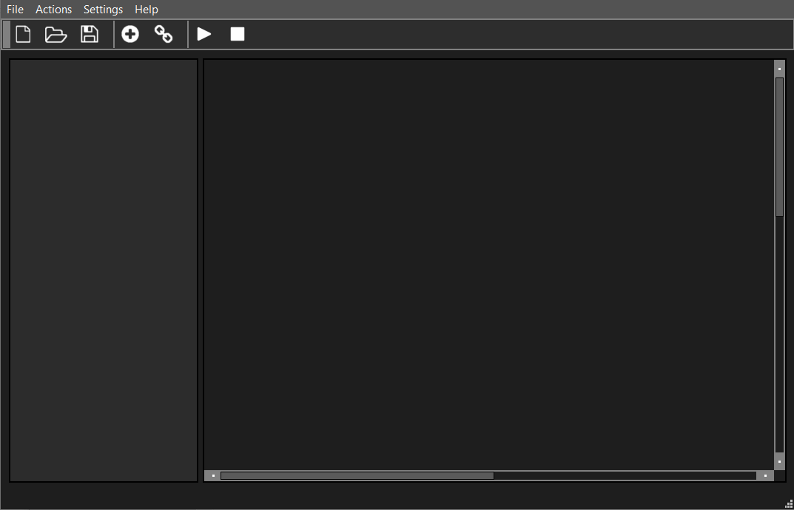

## Добавление модулей
- Для связи с устройством используется модуль __Contral Constance__
- Для отображения данных в виде графика используется модуль __Chart__
- Для отображения данных в виде таблицы используется модуль __Table__
- Для записи данных на жёсткий диск используется модуль __File__ 

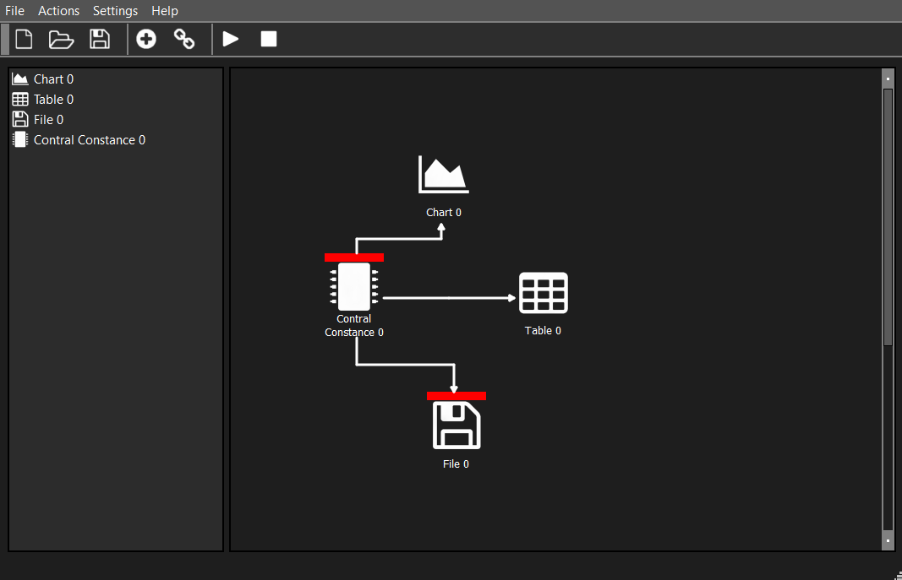

___
В меню модуля __Contral Constance__ можно: 
- установить интерфейс для обмена данными с устройством
- задать время записи
- отправить управляющую команду на устройство 

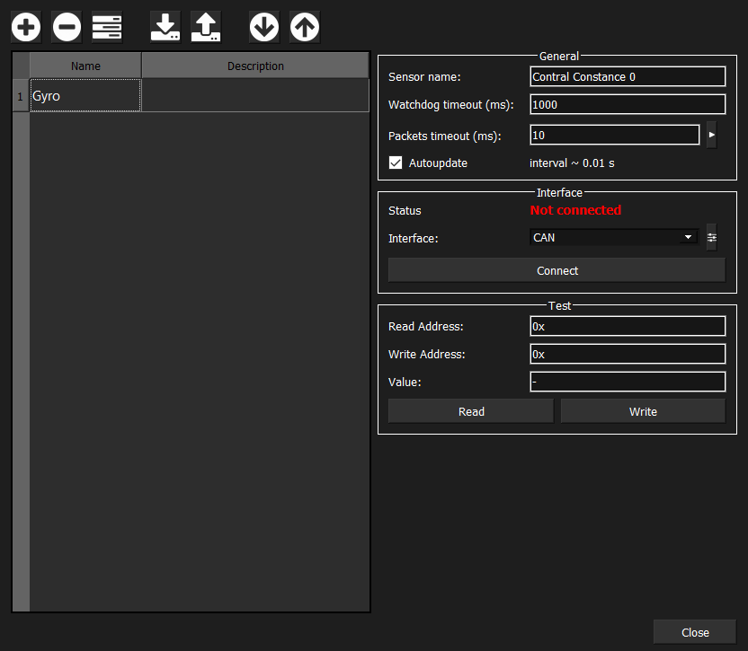


# Анализ данных с гироскопа

```python
import pandas as pd
import numpy as np
import matplotlib.pyplot as plt
from scipy.fftpack import fft, ifft, fftshift
```

### Таблица исходных данных с гироскопа   


```python
df_gyro = pd.read_csv("gyro_data.csv")
df_gyro
```


<div>

<table border="1" class="dataframe">
  <thead>
    <tr style="text-align: right;">
      <th></th>
      <th>gyro_x</th>
      <th>gyro_y</th>
      <th>gyro_z</th>
    </tr>
  </thead>
  <tbody>
    <tr>
      <th>0</th>
      <td>-0.010174</td>
      <td>0.022502</td>
      <td>-0.000522</td>
    </tr>
    <tr>
      <th>1</th>
      <td>0.008148</td>
      <td>-0.028474</td>
      <td>-0.006978</td>
    </tr>
    <tr>
      <th>2</th>
      <td>-0.002898</td>
      <td>0.023201</td>
      <td>0.009662</td>
    </tr>
    <tr>
      <th>3</th>
      <td>-0.002744</td>
      <td>-0.011388</td>
      <td>-0.007823</td>
    </tr>
    <tr>
      <th>4</th>
      <td>0.010530</td>
      <td>-0.003039</td>
      <td>0.003586</td>
    </tr>
    <tr>
      <th>...</th>
      <td>...</td>
      <td>...</td>
      <td>...</td>
    </tr>
    <tr>
      <th>9751</th>
      <td>0.001818</td>
      <td>-0.004874</td>
      <td>-0.008305</td>
    </tr>
    <tr>
      <th>9752</th>
      <td>-0.007095</td>
      <td>0.005194</td>
      <td>0.002707</td>
    </tr>
    <tr>
      <th>9753</th>
      <td>0.008883</td>
      <td>-0.003179</td>
      <td>0.005211</td>
    </tr>
    <tr>
      <th>9754</th>
      <td>-0.006830</td>
      <td>-0.001000</td>
      <td>-0.010581</td>
    </tr>
    <tr>
      <th>9755</th>
      <td>0.002112</td>
      <td>0.005949</td>
      <td>0.010683</td>
    </tr>
  </tbody>
</table>
<p>9756 rows × 3 columns</p>
</div>


## Визуализация исходных сигналов


```python
def printSignal(sig, N, name):
    # Plot results
    fig = plt.figure(figsize=(16, 5), dpi=100)
  
    plt.title(f'Signal {name}')
    plt.plot(sig)
    plt.xlim([0, N-1])
    plt.xlabel('samples')
    plt.grid()
```

### Угол поворота по оси Х


```python
N = df_gyro['gyro_x'].count() #random sequence length
gyro_x = df_gyro['gyro_x'].to_numpy()
printSignal(gyro_x, N, 'X axis')
```


    
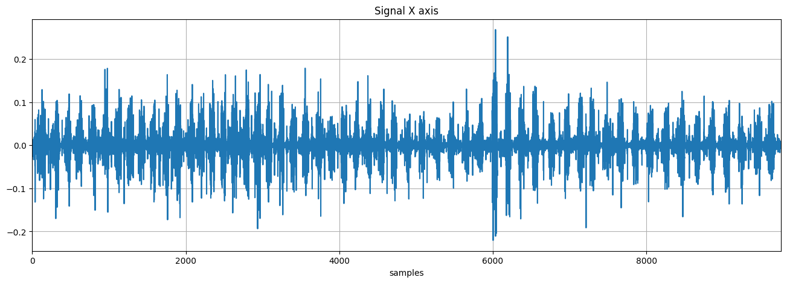
    


### Угол поворота по оси Y


```python
gyro_y = df_gyro['gyro_y'].to_numpy()
printSignal(gyro_y, N, 'Y axis')
```


    
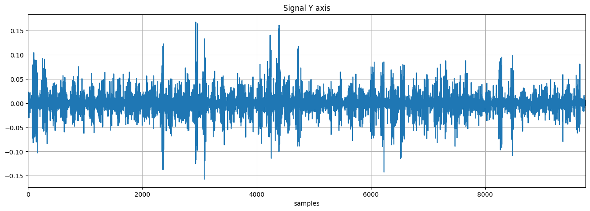
    


### Угол поворота по оси Z


```python
gyro_z = df_gyro['gyro_z'].to_numpy()
printSignal(gyro_z, N, 'Z axis')
```


    
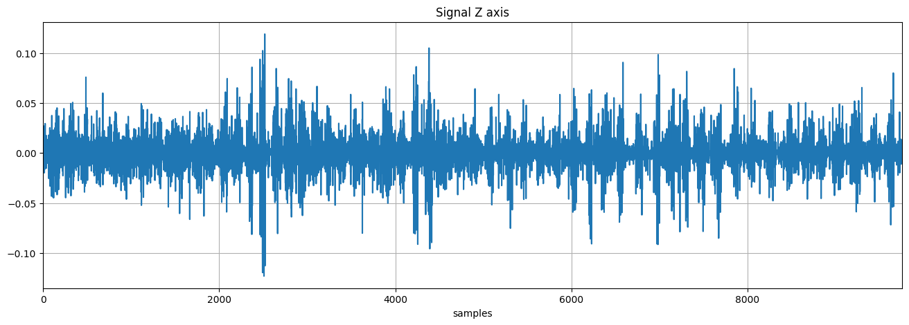
    


Видно, что при отстутствии воздействия на гироскоп, сигнал с датчиков ненулевой, а имеет вид случайной функции. 

## Определение характеристик случайного процесса
Плотность вероятности случайного сигнала позволяет определить математические моменты разного порядка:

- **Математическое ожидание**: среднее значение последовательности случайных величин

Для вычисления математического ожидания воспользуемся метод `mean()`

- **Дисперсия**: среднее значение квадратов разностей между значениями последовательности и её средним значением

Для вычисления дисперсии воспользуемся методом - `var()`, а для поиска среднеквадратического отклонения методом - `std()`.

### Функция плотности вероятности


```python
def printPDF(sig, N, name):
    s = sig.var()
    mu = sig.mean()
    
    fig = plt.figure(figsize=(16, 5), dpi=100)
    plt.title(f'Probability density function {name}')
    plt.xlabel('Value')
    plt.ylabel('Level')
    plt.hist(sig, 50,color='C1', label=r'$\mu = %f, \sigma$ = %f' % (mu, s))
    plt.grid()
    plt.legend(loc='upper left', fontsize=16)
```

### Гистограмма плотности вероятности для оси Х


```python
printPDF(gyro_x, N, 'X axis')
```


    
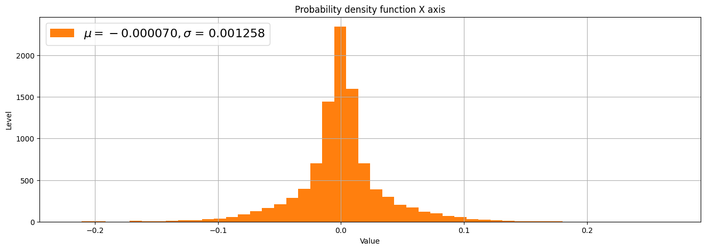
    


### Гистограмма плотности вероятности для оси Y


```python
printPDF(gyro_y, N, 'Y axis')
```


    
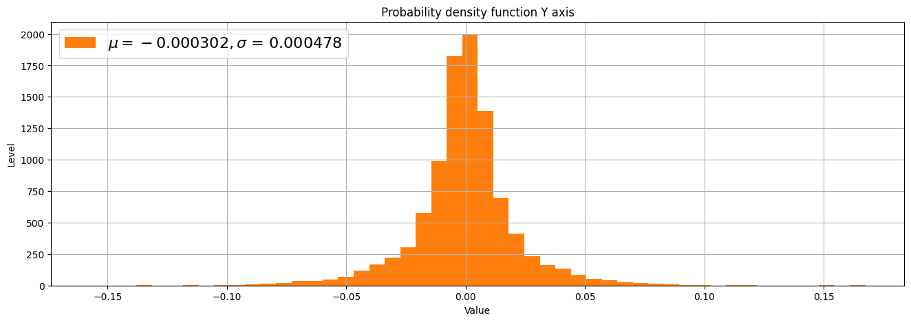
    


### Гистограмма плотности вероятности для оси Z


```python
printPDF(gyro_z, N, 'Z axis')
```


    
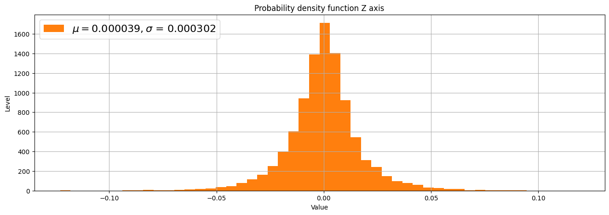
    


Гистограммы показывают, что распределение сигналов близко к нормальному.

## Спектральная плотность мощности 

Мы можем рассматривать спектральную плотность мощности как меру скорости изменения случайного процесса.

В библиотеке **scipy** есть пакет **fftpack**, который содержит основные функции для вычисления ДПФ (в частности БПФ).


```python
def calcFFT(sig, N):
    X = fft(sig)
    return 2*np.abs(X) / N

def printSpectrum(sig, N, name):
    X = calcFFT(sig, N)

    fig = plt.figure(figsize=(16, 5), dpi=100)
    plt.title(f'Spectrum {name}')
    plt.plot(X)
    plt.xlim([0, N//2-1])
    plt.xlabel('frequency')
    plt.grid()
```

### Спектральная плотность мощности для оси X


```python
printSpectrum(gyro_x, N, 'X axis')
```


    
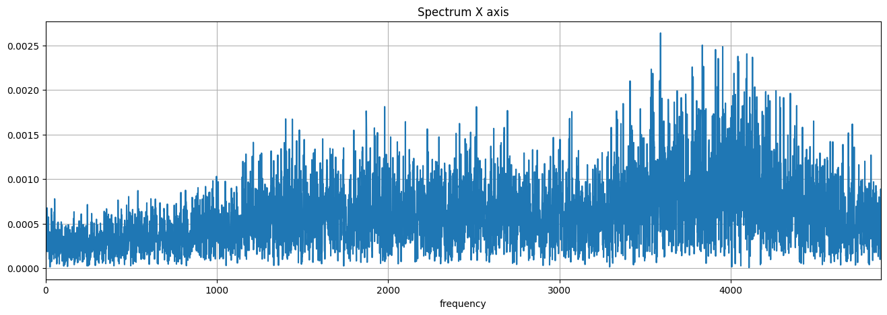
    


### Спектральная плотность мощности для оси Y


```python
printSpectrum(gyro_y, N, 'Y axis')
```


    
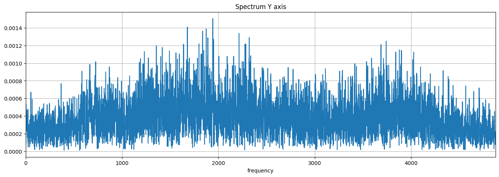
    


### Спектральная плотность мощности для оси Z


```python
printSpectrum(gyro_z, N, 'Z axis')
```


    
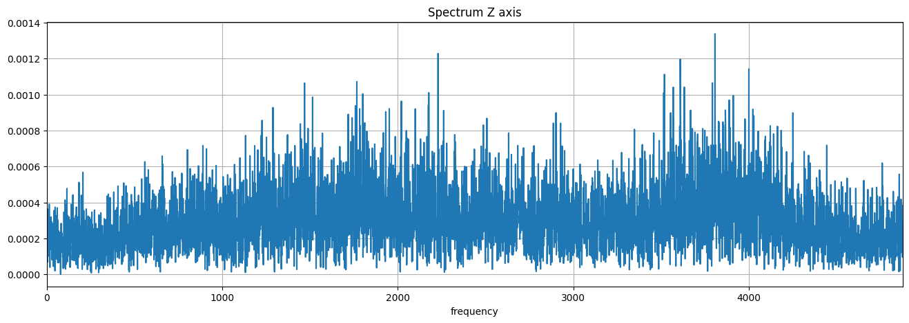
    


Полученные характеристики позволяют определить следующее параметры, необходимые для последующей фильтрации сигнала:


- **Отклонение**


- **Меру скорости изменения**


- **Отношение сигнал/шум**


- **Динамический диапазон**: отношение минимального и максимального возможных значений величины входного параметра.


- **Чувствительность**: минимальный уровень сигнала на входе системы, при котором сигнал распознаётся на фоне шумов. 


Качественная фильтрация шума способна уменьшить погрешность и увеличить качество измерения датчика.
