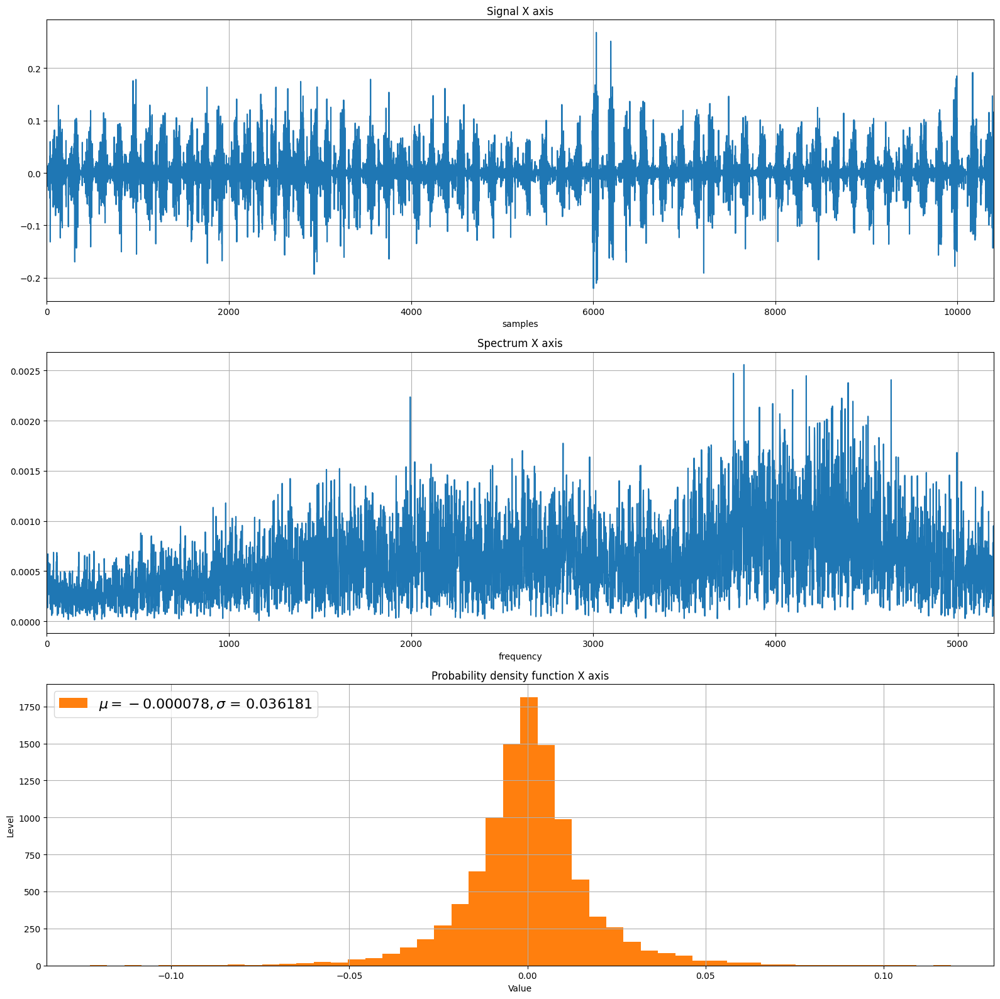
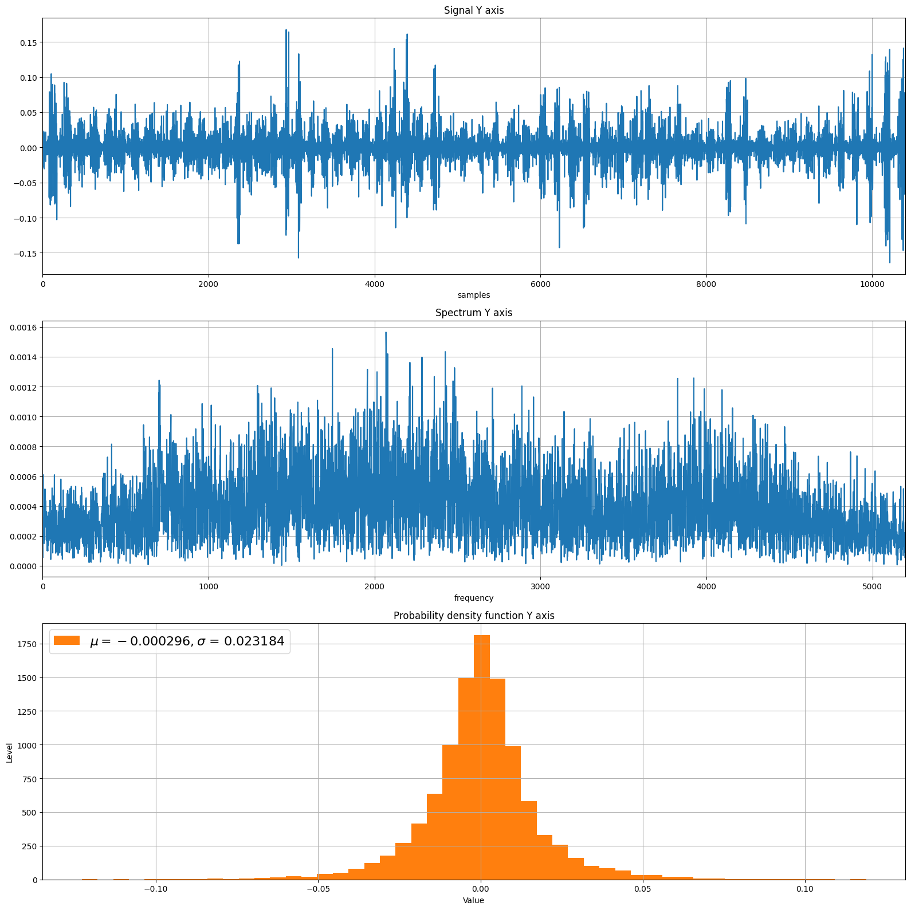
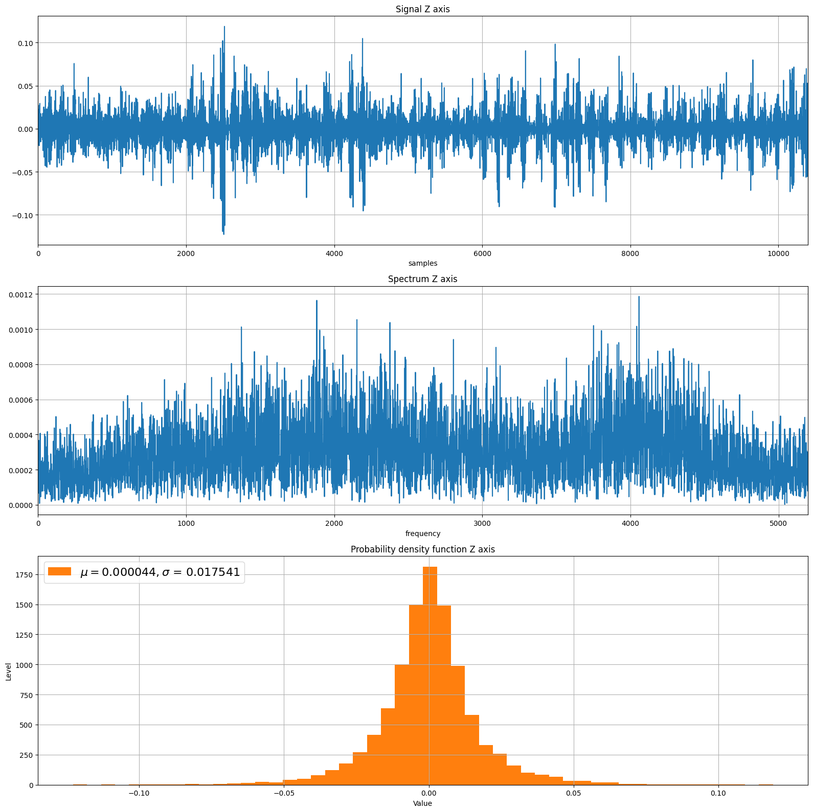

```python
import pandas as pd
import numpy as np
import matplotlib.pyplot as plt
from scipy.fftpack import fft, ifft, fftshift
```


```python
df_gyro = pd.read_csv("gyro_data.csv")
df_gyro
```


<div>
<style scoped>
    .dataframe tbody tr th:only-of-type {
        vertical-align: middle;
    }

    .dataframe tbody tr th {
        vertical-align: top;
    }

    .dataframe thead th {
        text-align: right;
    }
</style>
<table border="1" class="dataframe">
  <thead>
    <tr style="text-align: right;">
      <th></th>
      <th>gyro_x</th>
      <th>gyro_y</th>
      <th>gyro_z</th>
    </tr>
  </thead>
  <tbody>
    <tr>
      <th>0</th>
      <td>-0.010174</td>
      <td>0.022502</td>
      <td>-0.000522</td>
    </tr>
    <tr>
      <th>1</th>
      <td>0.008148</td>
      <td>-0.028474</td>
      <td>-0.006978</td>
    </tr>
    <tr>
      <th>2</th>
      <td>-0.002898</td>
      <td>0.023201</td>
      <td>0.009662</td>
    </tr>
    <tr>
      <th>3</th>
      <td>-0.002744</td>
      <td>-0.011388</td>
      <td>-0.007823</td>
    </tr>
    <tr>
      <th>4</th>
      <td>0.010530</td>
      <td>-0.003039</td>
      <td>0.003586</td>
    </tr>
    <tr>
      <th>...</th>
      <td>...</td>
      <td>...</td>
      <td>...</td>
    </tr>
    <tr>
      <th>10394</th>
      <td>0.048628</td>
      <td>0.054463</td>
      <td>-0.003674</td>
    </tr>
    <tr>
      <th>10395</th>
      <td>0.020511</td>
      <td>-0.006313</td>
      <td>-0.010710</td>
    </tr>
    <tr>
      <th>10396</th>
      <td>0.009710</td>
      <td>0.020821</td>
      <td>-0.020443</td>
    </tr>
    <tr>
      <th>10397</th>
      <td>-0.049864</td>
      <td>0.001303</td>
      <td>0.012972</td>
    </tr>
    <tr>
      <th>10398</th>
      <td>0.024212</td>
      <td>0.003681</td>
      <td>-0.004723</td>
    </tr>
  </tbody>
</table>
<p>10399 rows × 3 columns</p>
</div>


```python
def printSignal(sig, N, s, mu, name):
    X = fft(sig)
    X = 2*np.abs(X) / N

    # Plot results
    fig = plt.figure(figsize=(16, 16), dpi=100)
    # Time: signal
    plt.subplot(3, 1, 1)
    plt.title('Signal' + ' ' + name)
    plt.plot(sig)
    plt.xlim([0, N-1])
    plt.xlabel('samples')
    plt.grid()

    # Freq: Spectrum
    plt.subplot(3, 1, 2)
    plt.title('Spectrum' + ' ' + name)
    plt.plot(X)
    plt.xlim([0, N//2-1])
    plt.xlabel('frequency')
    plt.grid()

    plt.subplot(3, 1, 3)
    plt.title('Probability density function' + ' ' + name)
    plt.xlabel('Value')
    plt.ylabel('Level')
    plt.hist(z, 50,color='C1', label=r'$\mu = %f, \sigma$ = %f' % (mu, s))
    plt.grid()
    plt.legend(loc='upper left', fontsize=16)
    plt.tight_layout()
    
```


```python
N = df_gyro['gyro_x'].count()
gyro_x = df_gyro['gyro_x'].to_numpy()

s = df_gyro['gyro_x'].std()
mu = df_gyro['gyro_x'].mean()    
printSignal(gyro_x, N, s, mu, 'X axis')  
```


    

    


```python
N = df_gyro['gyro_y'].count()
gyro_y = df_gyro['gyro_y'].to_numpy()

s = df_gyro['gyro_y'].std()
mu = df_gyro['gyro_y'].mean()    
printSignal(gyro_y, N, s, mu, 'Y axis')  
```


    

    


```python
N = df_gyro['gyro_z'].count()
gyro_z = df_gyro['gyro_z'].to_numpy()

s = df_gyro['gyro_z'].std()
mu = df_gyro['gyro_z'].mean()    
printSignal(gyro_z, N, s, mu, 'Z axis')  

```


    

    

